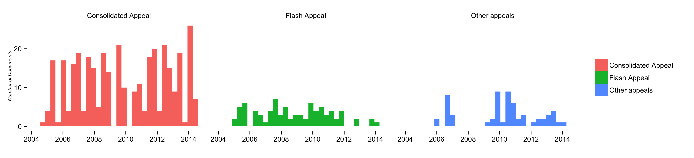
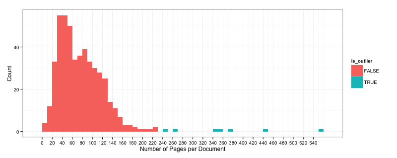

CAP Appeals Crowdsourcing Effort
================================

This repository contains all the code used in the crowd-sourcing initiative to exctract the figures from all the appels documents made public by OCHA.

## What are CAP Appeals?

The Consolidated Appeals Process (CAP), which was discontinued in 2014, was a mechanism used by aid organizations to jointly plan, coordinate, implement and monitor their response to natural disasters and complex emergencies. The consolidated appeal process consisted of a cycle of activities carried out with close collaboration between the stakeholders in a given crisis including NGOs, host government, donors, and the United Nations in which a common understanding of the humanitarian situation was reached, and an appropriate response to the situation was developed.

The major milestone in the Consolidated Appeal Process for each country was the development of the CAP document which contained the Common Humanitarian Action Plan (CHAP) including sector/cluster response plans as well as a list of the costed projects necessary to achieving the plan. A global appeal would also be prepared on the basis of the country appeals and launched in a consolidated and coordinated manner by the Emergency Relief Coordinator at the beginning of the year. A mid-year review of the CAP would be done, through which updated needs and requirements would be published.

The CAP documents are a rich source of data on the major humanitarian crises to affect various parts of the world in the past decade or so. Many lessons have been learnt from the CAP which was superseded in 2014 by the Humanitarian Programme Cycle.

CAP appeals are important because they consolidate a common-ground, agreed picture of a crisis within the humanitarian community. During the making of the CAP appeal most major humanitarian organizations agree on a set of figures that define how severe the crisis is and what is the extent of the needs. Among the figures defined in the CAP appeals are what we call "Humanitarian Planning Figures". This project was created to extract and analyze those figures.

## Initial Exploration

The appeal documents are usually public PDF documents that contain important figures about the humanitarian response to a crisis. Examples of those figures are the 'Number of People Affected', 'Number of People in Need', and the 'Number of People Reached', among others.

CAP appeals are generally grouped within 3 categories:

- **Consolidated Appeal:** the flagship humanitarian appeal document, it consolidates the appeal figures from the various humanitarian organizations responding to a particular crisis. They are commonly produced in protracted crisis at the end of the year for the next year; and at mid-year for reviewing purposes.

- **Flash Appeal:** flash appeals are quickly created to address a sudden onset crisis. Some flash appeals are consolidated within CAP appeals, especially if the crisis in question is a protracted crisis.

- **Other Appeal:** all other appeals that do not fall within the categories above. Commonly, there are topic specific appeals (e.g. gender issues, disease outbreaks t at a global scale).

There are 493 appeals listed in United Nations OCHA's CAP website: [http://www.unocha.org/cap/appeals/by-appeal/results](http://www.unocha.org/cap/appeals/by-appeal/results). The HDX team has created a web-scraper the collects the appeal information into a compiled list. The code for the web-scraper is available in this repository. And the compiled list can be found [here](https://github.com/luiscape/cap_appeals/blob/master/data/appeals_list.csv) (CSV).

When analyzing the list of appeals available in OCHA's CAP website we have a few insights. As seen in Figure 1, Sudan (26 appeals) appears to be the country / crisis that has the largest number of appeals, followed by Somalia (22 appeals) and Chad (22 appeals). Figure 2 shows that both Consolidated and Flash Appeals have a steady frequency, while Other Appeals have different frequency patterns:

*Figure 1: Distribution of Appeals by Country / Crisis.*

*Figure 2: Frequency of Appeals by Type.*

## Further Exploration

Extracting relevant data from the CAP documents is a challenging task. An programmatic approach could be used to extract those figures automatically from the 400+ documents. The problem, however, is that throughout the 10 years of documentation available, there have been many ways to reference those figures, ranging from the way figures are arranged on a page to linguistic differences. Moreover, even considering the IASC guidance, the Humanitarian Planning figures don't follow a strict methodology, and have been assembled by a combination of discretionary and political decision-making. The following excerpt illustrates the challenge:

>The humanitarian profile is a potentially politically sensitive dataset in that the numbers of affected people may be >seen to reflect on the capacities of national governments or international actors. The humanitarian profile numbers may >have financial implications in terms of donor funding. It is the responsibility of the Humanitarian Coordinator (HC) or >delegated individual to decide how political concerns impact any Humanitarian Profile datasets that are published and >address these concerns appropriately. Effectively, the HP needs not only a sound and documented technical basis but also >the political approval from the HC as well as the Humanitarian Country Team (HCT).

With that in mind, we have reached the initial conclusion that humans reading the documents could be one of the best ways of extracting those figures accurately. Considering the number of documents that need to be analyzed, we are considering a crowdsourcing approach.

The idea is to count with the help of qualified volunteer readers  to extract and categorize the data out of the appeals documents using volunteers' cognition and judgement. That approach would help us extract politically-generated figures consistently by the use of redundancy: if a large number of qualified readers reading the same document agree that a certain figure is valid, we use that figure. Reader's cognition and judgement would, then, add validity to the figures extracted.

We need to design the data collection strategy, explore feasible applications (i.e. [software](http://crowdcrafting.org/)), and construct a robust methodology before moving forward.

## Crowdsourcing

Considering the crowdsourcing could be the prefered approach, this section explores software and solutions in that area.

The prefered approach is to have each volunteer reader (from now on simply 'reader') read documents in full. That would allow us to rely that the figures reported by the reader are coherent with the overall message of the document, and not a disconnected and confusing page. Depending on a series of variable, each reader would read one or more documents.

We need to extract figures from roughly 493 documents. One of the biggest challenges is the number of pages that each document has. If we are to ask readers to read documents in full we have to give each reader an appropriate number of pages to read, without overwhelming them. The summary statistics of the number of pages are:
- 1st Quarter: ~42 pages
- Median: ~70 pages
- Mean: ~79 pages
- 3rd Quarter: ~104 pages
- Max: ~552 pages

The documents follow a normal distribution, but contains a few outliers that skews the distribution to the right as seen:

Other useful measurements are:
- Number of Outliers (3 x Standard Deviation | x > ~163): 19 documents
- > 200 pages: 11 documents
- > 100 pages: 133 documents

### Software

[Crowdcrafting](http://crowdcrafting.org/) is an open-source application created by the [Open Knowledge Foundation](http://blog.okfn.org/2013/09/17/crowdcrafting-putting-citizens-in-control-of-citizen-science/) to make easier the process of creating crowd-sourcing applications. This repository contains resources necessary for creating a Crowdcrafting application that reads PDF documents, displays them to users, and asks them questions about a certain page. The idea is to count with the help of volunteers to extract and categorize the data out of the appeals documents using volunteers' cognition and judgement.

## Usages

This repository contains scripts mainly written in `R`. It also uses the package [xpdf](http://www.foolabs.com/xpdf/download.html) to convert PDF to plain text to do text analysis.
