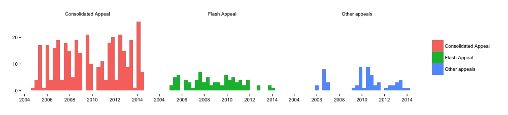

CAP Appeals Crowdsourcing Effort
================================

This repository contains all the code used in the crowd-sourcing initiative to exctract the figures from all the appels documents made public by OCHA.

Problem
-------

There are appeal documents about **74 countries** or regions.

Solution
--------

[To come ...]