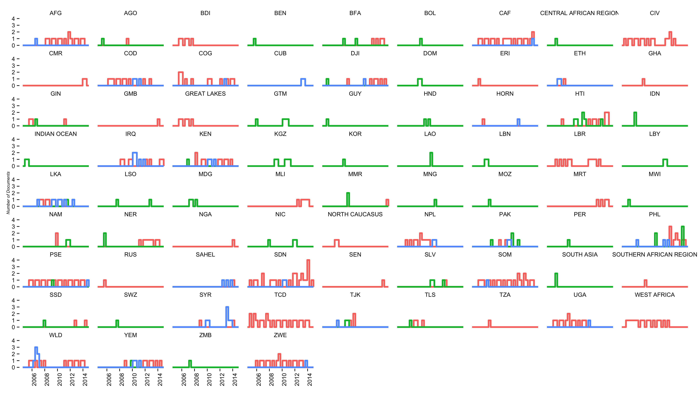
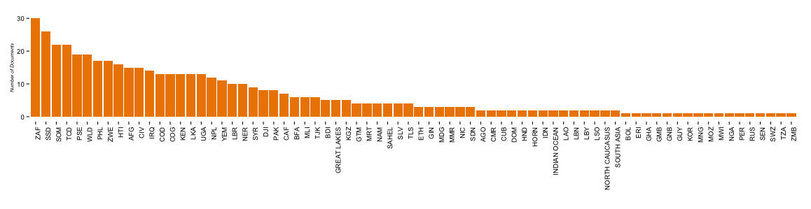

CAP Appeals Crowdsourcing Effort
================================

This repository contains all the code used in the crowd-sourcing initiative to exctract the figures from all the appels documents made public by OCHA.

Problem
-------

There are **492** appeals in about **74 countries** or regions. There are *827* documents 

After adding colors to each country, we can see the variety of countries represented in each report group.

Here we can see the distribution of reports per country (or crisis).

South Africa (30) seems to be the country that has the largest number of appeals, followed by South Sudan (26) and Somalia (22).

Solution
--------

[Crowdcrafting](http://crowdcrafting.org/) is an open-source application created by the [Open Knowledge Foundation](http://blog.okfn.org/2013/09/17/crowdcrafting-putting-citizens-in-control-of-citizen-science/) to make easier the process of creating crowd-sourcing applications.

Usage
-----

This repository contains scripts mainly written in `R`. It also uses the package `[xpdf](http://www.foolabs.com/xpdf/download.html)` to convert PDF to plain text to do text analysis.